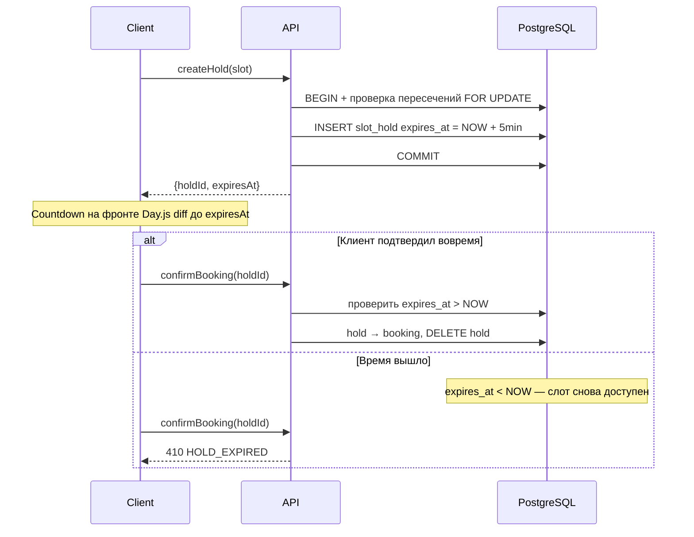
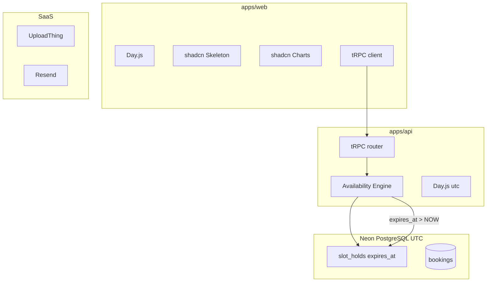

# Slotly: ускоренный план разработки (v5)

## Принцип: не изобретать велосипед

**Цель:** MVP за **~9–11 рабочих дней**.

Стратегия: готовые UI-блоки, tRPC, Better Auth, managed SaaS. **Без** pg-boss, Tremor, Cronofy/Nylas, внешней calendar sync.

---

## Дополнения v5 (утверждённые)

| # | Предложение | Вердикт | Зачем |
|---|-------------|---------|-------|
| 1 | **Zustand** для Booking Wizard | Да | Шаги услуга → дата → форма без prop drilling (~2KB) |
| 2 | **@hookform/resolvers** | Да | Обязателен для `zodResolver` + dynamic Zod schema |
| 3 | **date-fns** только для UI Calendar | Да | shadcn Calendar ожидает date-fns; бизнес-логика остаётся на Day.js |
| 4 | **lucide-react** | Да | Стандарт иконок shadcn/ui |
| 5 | **@fastify/rate-limit** | Да, критично | Защита `createHold` от бот-спама слотов |
| 6 | **@trpc/server/adapters/fastify** | Да | Официальный адаптер tRPC ↔ Fastify |
| 7 | **@neondatabase/serverless** + Drizzle | Да | Корректный пулинг для Neon, транзакции FOR UPDATE |
| 8 | **@t3-oss/env-core** | Да | Валидация ENV при старте (Neon, Resend, JWT) |
| 9 | **tsx** | Да | Быстрый dev-запуск Fastify вместо ts-node |

**Вердикт: да, вариант правильный. Не удлиняет MVP, предотвращает типичные ловушки.**

---

## Финальный стек MVP (утверждённый)

| Задача | Решение | Работает? | Экономия |
|--------|---------|-----------|----------|
| API + типы | **tRPC** | Да | ~2–3 дня vs REST+Swagger |
| Auth | **Better Auth** | Да | ~2 дня (сессии, cookies из коробки) |
| Timezone | **Day.js** + `utc` + `timezone` | Да | Единый подход фронт/бэк, Neon хранит UTC |
| Hold timeout | **Пассивный `expires_at`** | Да | ~0.5 дня vs pg-boss worker; SQL фильтрует просроченные |
| Loading UI | **shadcn Skeleton** | Да | Паттерн `isLoading ? <Skeleton/> : <Content/>` |
| Кастомные поля | **JSONB** + dynamic Zod + RHF | Да | Без миграций при новых полях |
| Календарь клиента | **ics** + add-to-calendar-button | Да | Бесплатно, без Google API |
| Календарь мастера | **FullCalendar** | Да | Единственный источник правды |
| Аналитика | **shadcn Charts** (Recharts) | Да | Тот же дизайн-код, 0 лишних UI-библиотек |
| Email | **Resend** | Да | 3000 писем/мес бесплатно |

**Вердикт: да, всё будет работать. Стек проще v3 и экономит ~1 день на инфраструктуре.**

---

## Hold timeout: пассивный `expires_at` (вместо pg-boss)

### Почему это работает

Просроченный hold **не блокирует слот**, если availability engine всегда фильтрует:

```sql
-- При расчёте занятых слотов:
SELECT * FROM slot_holds
WHERE master_id = $1
  AND expires_at > NOW()   -- ключевое условие
  AND booking_id IS NULL;
```

Удалять строки из БД **не обязательно** для корректности — SQL сам «отсекает» просроченные. Запись может лежать в таблице, но слот уже свободен.

### Flow



### Реализация

```typescript
// createHold
const expiresAt = dayjs.utc().add(5, 'minute').toDate();
await tx.insert(slotHolds).values({ masterId, serviceId, startsAt, expiresAt });

// confirmBooking
const hold = await tx.query.slotHolds.findFirst({ where: eq(slotHolds.id, holdId) });
if (!hold || dayjs.utc(hold.expiresAt).isBefore(dayjs.utc())) {
  throw new TRPCError({ code: 'CONFLICT', message: 'HOLD_EXPIRED' });
}

// availability — всегда
const activeHolds = await db.select().from(slotHolds).where(
  and(eq(slotHolds.masterId, masterId), gt(slotHolds.expiresAt, sql`NOW()`))
);
```

### Опционально post-MVP (не для корректности)

```sql
-- Раз в сутки, cron или Neon scheduled job — уборка мусора
DELETE FROM slot_holds WHERE expires_at < NOW() - INTERVAL '1 day';
```

### Что убрали

- pg-boss delayed jobs
- `pg_boss_job_id` в таблице
- Worker `expire-hold`
- Cancel job при confirm

**Экономия:** ~0.5 дня на настройку pg-boss + проще деплой (один процесс API).

---

## Аналитика: shadcn Charts вместо Tremor

### Почему лучше для Slotly

- **Один UI-kit:** Card, Skeleton, Charts — всё shadcn, единые CSS-переменные `--chart-1`…`--chart-5`
- **Под капотом Recharts** — зрелая библиотека, не абстракция
- **Готовые chart blocks** на ui.shadcn.com/charts — Area, Bar, Pie копируются за минуты

### 3 виджета MVP

| Виджет | Компонент | Данные (tRPC) |
|--------|-----------|---------------|
| Выручка за период | `AreaChart` + shadcn `Card` | `SUM(price) GROUP BY day` |
| Загруженность % | `Card` + progress bar / Radial | `booked_minutes / available_minutes` |
| Топ-3 услуги | `BarChart` горизонтальный | `COUNT(*) GROUP BY service_id LIMIT 3` |

```bash
npx shadcn@latest add chart card
pnpm add recharts
```

**vs Tremor:** Tremor быстрее «из коробки» для KPI, но добавляет второй дизайн-язык. shadcn Charts — +1–2 часа на сборку, но 0 конфликтов стилей. **Итог: примерно одинаково по времени, лучше по консистентности.**

---

## Матрица «Своё vs Готовое» (полная)

| Задача | Было (медленно) | Стало (быстро) | Экономия |
|--------|-----------------|----------------|----------|
| API + типы | REST + Swagger + axios | **tRPC** | ~2–3 дня |
| Auth | JWT вручную | **Better Auth** | ~2 дня |
| Timezone | `new Date()` + offset | **Day.js** + `utc` + `timezone` | ~0.5–1 день |
| Hold timeout | pg-boss worker / in-memory | **`expires_at` + SQL filter** | ~0.5 дня |
| Loading UI | Кастомные спиннеры | **shadcn Skeleton** | ~0.5 дня |
| Кастомные поля | Жёсткие колонки | **JSONB** + dynamic Zod + RHF | ~2 дня позже |
| Календарь клиента | Google Calendar API | **ics** + add-to-calendar-button | ~2 дня |
| Календарь мастера | Внешняя sync | **FullCalendar** | ~3–4 дня |
| Публичный календарь | Кастомная сетка | **react-day-picker** + shadcn Calendar | ~1–2 дня |
| CRM-таблица | Кастомная | **TanStack Table** + DataTable block | ~1–2 дня |
| Аналитика | Кастом / Tremor | **shadcn Charts** (Recharts) | ~1 день |
| Email | Nodemailer | **Resend** | ~1 день |
| Аватары | MinIO/S3 | **UploadThing** | ~1 день |
| Recurrence | Кастом | **rrule** | ~1 день |
| DB prod | Self-hosted | **Neon** (UTC timestamptz) | deploy time |

---

## Стек (финальный)

### Monorepo

```
slotly/
├── apps/
│   ├── web/                    # Vite + React 18 + TS
│   └── api/                    # Fastify + tRPC + Better Auth (без pg-boss)
├── packages/
│   ├── shared/                 # Zod, Day.js helpers, form builders
│   ├── db/                     # Drizzle schema + migrations
│   └── trpc/                   # tRPC routers
├── turbo.json
├── pnpm-workspace.yaml
└── docker-compose.yml          # PostgreSQL local (prod → Neon)
```

### Frontend (`apps/web`)

| Категория | Библиотека |
|-----------|-----------|
| Даты / бизнес-логика | **dayjs** + `utc` + `timezone` |
| Даты / UI Calendar | **date-fns** (только shadcn Calendar, не для API) |
| Wizard state | **zustand** (`useBookingStore`) |
| Формы | RHF + Zod + **@hookform/resolvers** (`zodResolver`) |
| Иконки | **lucide-react** |
| Loading | shadcn Skeleton |
| UI | shadcn/ui + blocks |
| Charts | shadcn chart + recharts |
| API | tRPC + TanStack Query |
| Календарь (public) | react-day-picker + shadcn Calendar |
| Календарь (admin) | FullCalendar |
| CRM | TanStack Table |
| Mobile modal | vaul |
| Toasts | sonner |

#### Zustand: Booking Wizard store

```typescript
// apps/web/src/stores/booking-store.ts
interface BookingState {
  step: 1 | 2 | 3;
  serviceId: string | null;
  selectedDate: string | null;   // UTC ISO date
  selectedSlot: string | null;   // UTC ISO datetime
  holdId: string | null;
  expiresAt: string | null;
  setService: (id: string) => void;
  setSlot: (date: string, slot: string, holdId: string, expiresAt: string) => void;
  reset: () => void;
}
```

Шаги: `1` услуга → `2` дата/время (+ hold) → `3` форма контактов.

#### Day.js vs date-fns — правило разделения

| Слой | Библиотека | Примеры |
|------|-----------|---------|
| API-ответы, слоты, таймер hold | **Day.js** | `formatSlot()`, `holdExpiresIn()` |
| shadcn `<Calendar>` | **date-fns** | `format()`, `addDays()` в calendar.tsx |
| Конвертация между ними | `date.toISOString()` / `new Date(iso)` | На границе Calendar ↔ store |

Не пишем адаптеры Day.js ↔ react-day-picker — это съест день. Две маленькие зависимости дешевле.

#### Формы с dynamic schema

```typescript
import { zodResolver } from '@hookform/resolvers/zod';
import { buildBookingZodSchema } from '@slotly/shared';

const schema = buildBookingZodSchema(formSchema);
const form = useForm({ resolver: zodResolver(schema) });
```

### Backend (`apps/api`)

| Категория | Библиотека |
|-----------|-----------|
| HTTP + API | Fastify + **@trpc/server/adapters/fastify** |
| Rate limit | **@fastify/rate-limit** (критично на public mutations) |
| Auth | Better Auth |
| ORM | Drizzle + drizzle-zod |
| DB (local) | `postgres` (postgres.js) → Docker |
| DB (prod) | **@neondatabase/serverless** + `drizzle-orm/neon-serverless` |
| Даты / TZ | dayjs + utc + timezone |
| Recurrence | rrule |
| ICS | ics npm |
| Email | Resend |
| Dev | **tsx** watch |

#### tRPC + Fastify (официальный адаптер)

```typescript
import { fastifyTRPCPlugin } from '@trpc/server/adapters/fastify';

await server.register(fastifyTRPCPlugin, {
  prefix: '/trpc',
  trpcOptions: { router: appRouter, createContext },
});
```

#### Rate limit — защита createHold

```typescript
// Строже для мутаций бронирования
await server.register(rateLimit, {
  global: false,
});

server.register(async (instance) => {
  instance.register(rateLimit, {
    max: 10,
    timeWindow: '1 minute',
    keyGenerator: (req) => req.ip,
  });
  // createHold, confirmBooking procedures
}, { prefix: '/trpc/public.booking' });
```

Дополнительно: per-`masterId` лимит holds (max 3 active holds с одного IP на мастера).

#### Neon + Drizzle

```typescript
// packages/db/src/client.ts
import { Pool } from '@neondatabase/serverless';
import { drizzle } from 'drizzle-orm/neon-serverless';

// Prod: Neon WebSocket pool (нужен для транзакций FOR UPDATE)
const pool = new Pool({ connectionString: env.DATABASE_URL });
export const db = drizzle(pool);

// Dev (Docker): postgres.js
// import { drizzle } from 'drizzle-orm/postgres-js';
```

`FOR UPDATE` при createHold требует **neon-serverless** (WebSocket), не neon-http.

### DevEx / Monorepo

| Категория | Библиотека |
|-----------|-----------|
| ENV валидация | **@t3-oss/env-core** + Zod |
| Dev-запуск API | **tsx watch src/server.ts** |
| Сборка monorepo | Turborepo |

```typescript
// packages/shared/src/env.ts
import { createEnv } from '@t3-oss/env-core';
import { z } from 'zod';

export const env = createEnv({
  server: {
    DATABASE_URL: z.string().url(),
    BETTER_AUTH_SECRET: z.string().min(32),
    RESEND_API_KEY: z.string().optional(),
  },
  runtimeEnv: process.env,
});
```

Падение при старте с понятной ошибкой вместо `undefined is not a function` в проде.

**Убрано из MVP:** pg-boss, Tremor, Cronofy/Nylas.

### Day.js: единый контракт timezone

```typescript
// packages/shared/src/datetime.ts
import dayjs from 'dayjs';
import utc from 'dayjs/plugin/utc';
import timezone from 'dayjs/plugin/timezone';

dayjs.extend(utc);
dayjs.extend(timezone);

export const toUTC = (local: string, tz: string) =>
  dayjs.tz(local, tz).utc().toISOString();

export const formatSlot = (utcIso: string, tz: string) =>
  dayjs.utc(utcIso).tz(tz).format('HH:mm');

export const holdExpiresIn = (expiresAt: string) =>
  Math.max(0, dayjs.utc(expiresAt).diff(dayjs.utc(), 'second'));
```

---

## shadcn Skeleton: стандарт loading

```tsx
const { data, isLoading } = trpc.public.getMasterProfile.useQuery({ username });
if (isLoading) return <ProfileSkeleton />;
```

Skeleton-варианты: `ProfileSkeleton`, `ServicesSkeleton`, `TimeslotGridSkeleton`, `CalendarSkeleton`, `DataTableSkeleton`, `ChartSkeleton`.

Spinner (`Loader2`) — только на кнопках submit.

---

## JSONB: кастомные поля (гибрид)

| Данные | Хранение |
|--------|----------|
| Имя, телефон | Колонки `clients` (CRM, поиск) |
| Email, комментарий | Колонки (частые кейсы) |
| Доп. поля | JSONB `custom_field_values` + `booking_form_schema` в settings |

Dynamic Zod builder + `DynamicBookingForm` на фронте. Form Field Builder в `/admin/settings`.

---

## Календари

- **Мастер:** FullCalendar — единственный источник правды
- **Клиент:** ICS + add-to-calendar-button на success page
- **Внешняя sync (Google/Outlook):** out of scope

---

## Архитектура



---

## Доменная модель

| Таблица | Ключевые поля |
|---------|---------------|
| `masters` | id, email, username, timezone |
| `master_settings` | buffer_min, min_advance_hours, horizon_days, booking_form_schema JSONB |
| `slot_holds` | starts_at, **expires_at timestamptz**, service_id (без pg_boss_job_id) |
| `bookings` | starts_at, ends_at UTC, status, comment, custom_field_values JSONB |
| `clients` | name, phone, email |

---

## Ускоренные фазы

### Фаза 0 — Scaffold (1 день)
- Turborepo + Drizzle + Neon config
- Fastify + **@trpc/server/adapters/fastify** + Better Auth + **@fastify/rate-limit**
- **@t3-oss/env-core** в packages/shared
- Vite + shadcn init (Skeleton, Chart, Calendar) + Day.js + **date-fns** + **lucide-react**
- **tsx** dev script для API
- Zustand store skeleton

### Фаза 1 — Auth + Admin Core (2–3 дня)
- Auth, onboarding, services CRUD, work schedule
- Form Field Builder (JSONB)

### Фаза 2 — Booking Flow (2–3 дня)
- Availability Engine + **passive holds (expires_at)**
- Публичная страница + DynamicBookingForm + countdown timer
- Success + ICS

### Фаза 3 — Admin Calendar + CRM (2–3 дня)
- FullCalendar + DnD, Clients DataTable

### Фаза 4 — Analytics + Polish (1–2 дня)
- **shadcn Charts** dashboard (3 виджета)
- UploadThing, Resend stub, Sentry

### Post-MVP
- i18n, SMS, E2E, CSV export
- Опционально: cleanup cron для старых holds, ICS-feed URL мастера

---

## Оценка сроков

| Фаза | Срок |
|------|------|
| 0 Scaffold | 1 день |
| 1 Auth + Admin Core | 2–3 дня |
| 2 Booking Flow | 2–3 дня |
| 3 Calendar + CRM | 2–3 дня |
| 4 Analytics + Polish | 1–2 дня |
| **MVP итого** | **~9–11 дней** |

---

## Package.json

### `apps/web`

```json
{
  "dependencies": {
    "dayjs": "^1.11",
    "date-fns": "^4",
    "zustand": "^5",
    "@hookform/resolvers": "^3",
    "lucide-react": "^0.475",
    "recharts": "^2",
    "@trpc/client": "^11",
    "@trpc/react-query": "^11",
    "@tanstack/react-query": "^5",
    "@tanstack/react-table": "^8",
    "@fullcalendar/react": "^6",
    "react-day-picker": "^9",
    "react-hook-form": "^7",
    "react-phone-number-input": "^3",
    "vaul": "^1",
    "sonner": "^2",
    "add-to-calendar-button-react": "^2",
    "zod": "^3",
    "better-auth": "^1"
  }
}
```

### `apps/api`

```json
{
  "dependencies": {
    "dayjs": "^1.11",
    "fastify": "^5",
    "@trpc/server": "^11",
    "@fastify/rate-limit": "^10",
    "@fastify/cors": "^10",
    "@neondatabase/serverless": "^0.10",
    "better-auth": "^1",
    "drizzle-orm": "^0.38",
    "postgres": "^3",
    "rrule": "^2",
    "ics": "^3",
    "resend": "^4",
    "zod": "^3"
  },
  "devDependencies": {
    "tsx": "^4",
    "drizzle-kit": "^0.30"
  }
}
```

### `packages/shared`

```json
{
  "dependencies": {
    "@t3-oss/env-core": "^0.12",
    "zod": "^3",
    "dayjs": "^1.11"
  }
}
```

---

## Итоговые решения

| Решение | MVP? | Обоснование |
|---------|------|-------------|
| tRPC | **Да** | Типы end-to-end, без REST boilerplate |
| Better Auth | **Да** | Сессии из коробки |
| Day.js + timezone | **Да** | Единый подход, Neon UTC |
| Passive expires_at | **Да** | Проще pg-boss, SQL фильтрует — работает корректно |
| shadcn Skeleton | **Да** | Единый loading pattern |
| shadcn Charts | **Да** | Консистентный UI, Recharts под капотом |
| JSONB fields | **Да** | Гибкость без миграций |
| FullCalendar | **Да** | Календарь мастера |
| ICS для клиентов | **Да** | Бесплатно |
| Resend | **Да** | 3000 emails/mo free |
| Zustand wizard | **Да** | Без prop drilling между шагами |
| @hookform/resolvers | **Да** | zodResolver для dynamic forms |
| date-fns (UI only) | **Да** | shadcn Calendar, Day.js для логики |
| lucide-react | **Да** | Иконки shadcn |
| @fastify/rate-limit | **Да** | Критично для createHold |
| @trpc/server/adapters/fastify | **Да** | Официальный адаптер |
| @neondatabase/serverless | **Да** | Транзакции FOR UPDATE на Neon |
| @t3-oss/env-core | **Да** | Fail-fast при старте |
| tsx | **Да** | Быстрый dev |
| pg-boss | **Нет** | Избыточен при passive expires_at |
| Tremor | **Нет** | Заменён shadcn Charts |
| Cronofy/Nylas | **Нет** | Out of scope |
